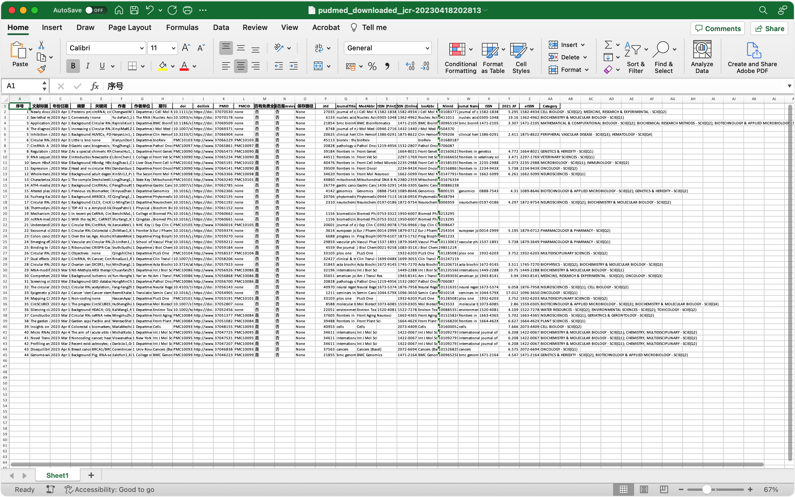

# Pubmed_Clawer


## 简单使用方法

```bash
python main_protect.py --url "?term=circRNA&format=abstract&sort=date&size=50" --pagenums 1 --papernumber 1

```

参数解释：

`--url`网页链接，仿照我的例子进行填写

`--pagenums`你想要查找多少页

`--papernumber`下载多少篇免费文章；小提示：如果你不想下载文献就填0，如果你想现在很多文献，这个参数就不要设置。


### 详细使用方法

1.打开pubmed，https://pubmed.ncbi.nlm.nih.gov/在pubmed搜点你想要的东西，比如我以关键词circRNA为关键词进行检索

2.将地址栏中位于nih.gov/后的参数复制下来，比如我这里是
“?term=circRNA&format=abstract&sort=date&size=50”

4.在终端或者python环境下运行，`简单使用方法`的命令。

5.需要注意的是，输入页数时，每页50个，如果数字太大，对服务器造成负担可能会导致ip被封（暂未发现），建议控制在20页以下。然后输入需要下载的文献数量，程序会从搜索结果中找到free pmc 免费文献，自动下载，这里下载速度取决你的网络状况。每个文献下载超过60s自动超时跳过，下载下一个。

6.文献会自动下载到的"document/pub/"下

7.文章信息会保存在research_res文件夹下，推荐查看含有jcr字母文件名的文件。（内含影响因子2021年度）

8.程序集成了sic_hub功能


## 报错是因为没有安装依赖

运行这个即可
-----

```bash
pip install -r requirements.txt
```


------


## 结果展示




## 其他  

主要功能：

基于简单的bs4和urllib的pubmed文献信息爬取和下载的爬虫，自动按照导入的链接，按你的要求下载指定数量的搜索结果文献

下载速度大概是10s一篇，同时能够提取文献的大部分信息，并自动生成excel文件，包括文献标题，摘要，关键词，作者名单，作者单位，是否免费，是不是review类型等信息

自动下载后，会将部分信息储存在本地的文本文件中，供参考，检索数据会储存在sqlite3数据库中，最后执行完成后，自动导出所有信息，生成一个Excel文件访问查看

依赖模块：


主要使用了bs4，re，xlwt，urllib这些模块

发布的版本中有pyintaller打包成的exe执行文件，如果需要自己在python环境运行则需要安装以下模块哦

需要导入的外部模块：

beautifulsoup4

eventlet 

importlib-metadata==4.11.3

pefile==2021.9.3

xlwt==1.3.0

模块介绍：

main.py文件是整个项目运行的主要文件
spiderpub.py负责从pubmed检索页提取出所有的必要信息，储存到数据库和txt文本文件中
geteachinfo.py负责从数据库提取出spiderpub提取的信息，打开每个文献的单独页面，提取摘要和关键词等，获得pmcid，即文献下载地址信息
downpmc.py文件再次从数据库中提取出每个pmcid，打开页面对文献进行下载，储存，同时将保存路径储存到sqlite3数据库，最后将sqlite3中的提取的所有关于文献的信息导出到excel文件中。

timevar.py文件，里面含有一个在整个程序一次运行中，需要被所有模块都调用的信息，savetime，会被用于生成txt文件和excel文件名称，还有sqlite3中的table名称

save2excel.py文件是针对有时候爬虫没执行完又想导出信息的一个模块，独立于以上组件，只要有sql数据库和table就能查询保存成excel


TO DO:

整合chatgpt


